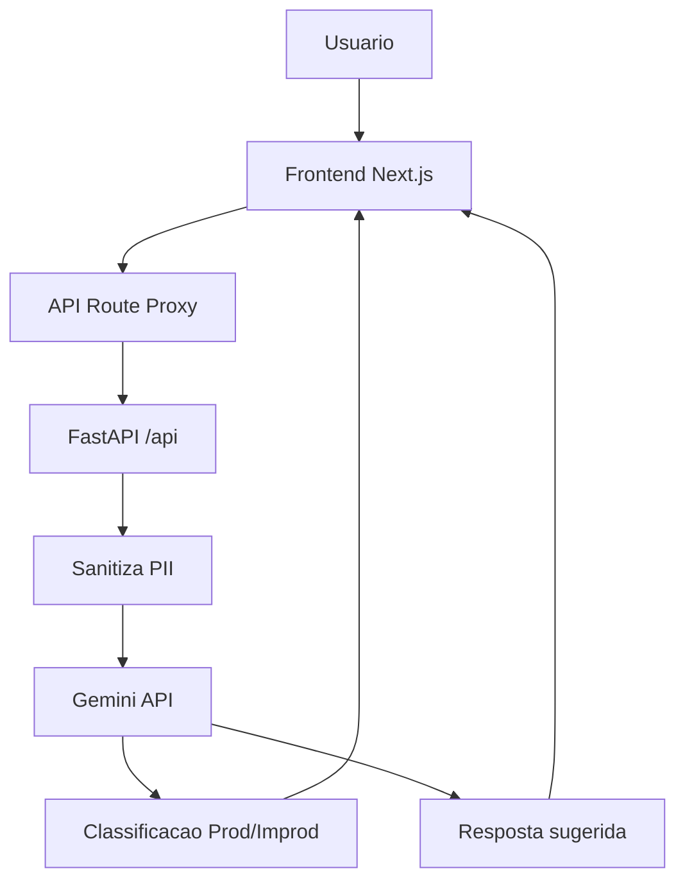

# Plano de Desenvolvimento — Classificador de Emails com Gemini

## Visão Geral
- App web simples para classificar emails em Produtivo/Improdutivo e sugerir respostas automáticas.
- Backend Python (FastAPI) integrando Gemini para classificação e resposta.
- Frontend Next.js 16 (React 19 + Tailwind CSS 4) para upload de .txt/.pdf ou texto colado.
- Deploy serverless: Vercel (frontend) + Railway (backend).

## Arquitetura (alto nível)

## Etapas por Fase
1) Planejamento
   - Escolher alvo de deploy (Vercel front e Railway backend). FEITO
   - Definir formato de variaveis de ambiente (chave Gemini, limites de tamanho). FEITO
2) Backend (FastAPI)
   - Criar endpoints `/api/health` e `/api/analyze`. FEITO
   - Implementar leitura de texto (.txt direto; .pdf com extracao). FEITO
   - Pre-processar (lowercase, stopwords, normalizacao basica; opcional lematizacao). FEITO
   - Montar prompt de classificacao (Produtivo/Improdutivo) com exemplos. FEITO
   - Montar prompt de resposta condicionado a categoria; fallback seguro se ambigua. FEITO
   - Adicionar limites de tamanho e sanitizacao basica (remover PII simples quando possivel). FEITO
3) Frontend
   - Form upload (.txt/.pdf) e textarea de texto colado. FEITO
   - Botao de enviar para processamento; estado de carregamento. FEITO
   - Exibir categoria, confianca (se fornecida), resposta sugerida; botao de copiar. FEITO
   - Mensagens de erro claras (tipo de arquivo, tamanho, falha de API). FEITO
4) Observabilidade e Qualidade
   - Logs basicos sem PII; marcar casos ambigos como "revisar". FEITO
   - Botao opcional "corrigir classificacao" para feedback manual (persistencia simples ou mock). FEITO
5) Deploy
   - Ajustar configuracao do alvo escolhido (env vars, timeout, build). FEITO
   - Gerar instrucoes no README para execucao local e deploy. FEITO
   - Opcional: Dockerfile para portabilidade. (pendente)

## Entregaveis Esperados
- Este `PLAN.md` na raiz.
- `backend/` com FastAPI + integracao Gemini.
- `frontend/` com Next.js (React 19 + Tailwind CSS 4).
- `requirements.txt`; `README.md` com setup e deploy.
- Opcional: Dockerfile.

## Tarefas (checklist)
- [x] Confirmar alvo de deploy.
- [x] Implementar FastAPI com integracao Gemini.
- [x] Criar UI de upload/texto e integracao com API.
- [ ] Testar prompts e ajustar classificacao/resposta.
- [x] Documentar e preparar deploy na nuvem.
